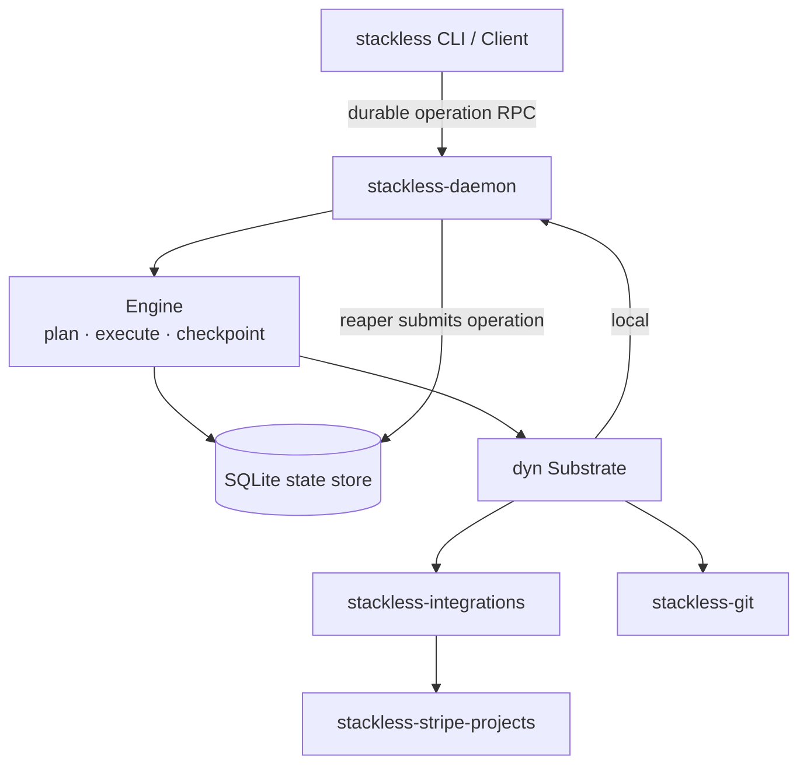
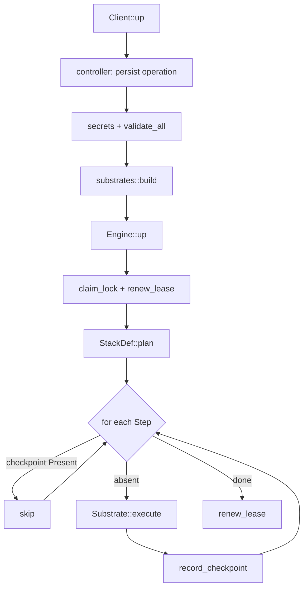
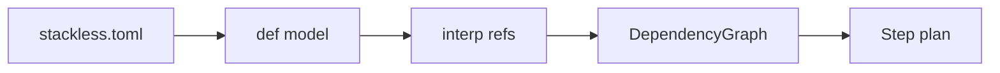
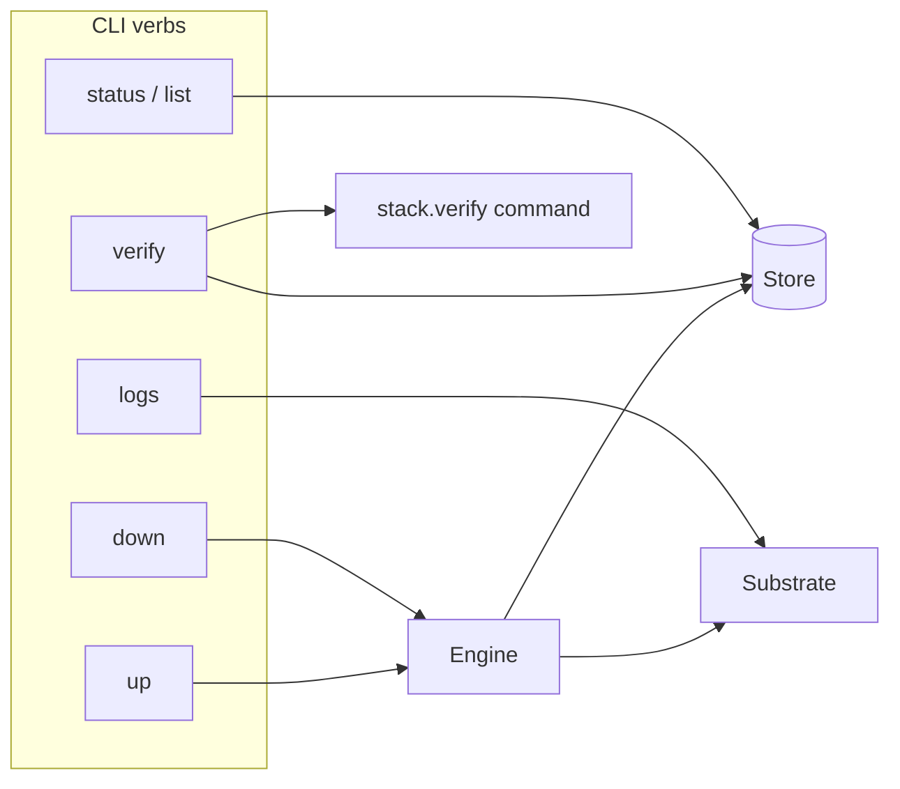
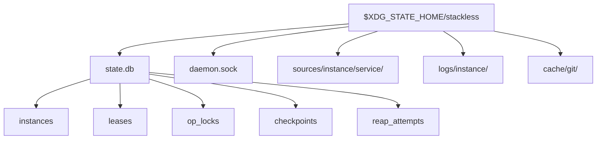
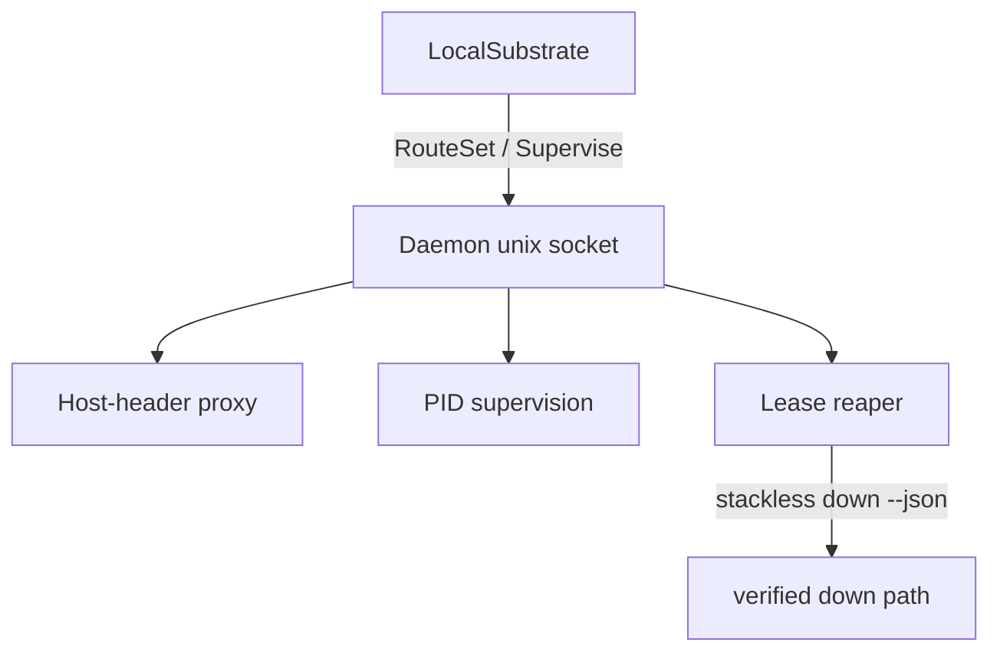
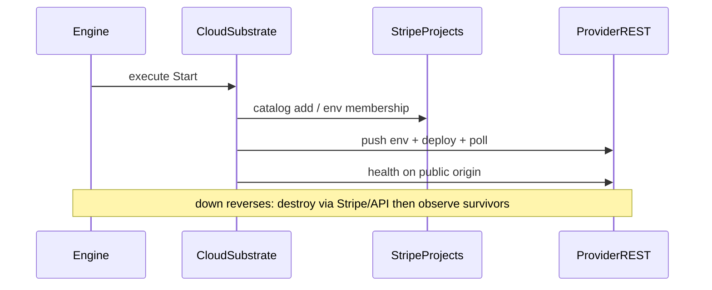
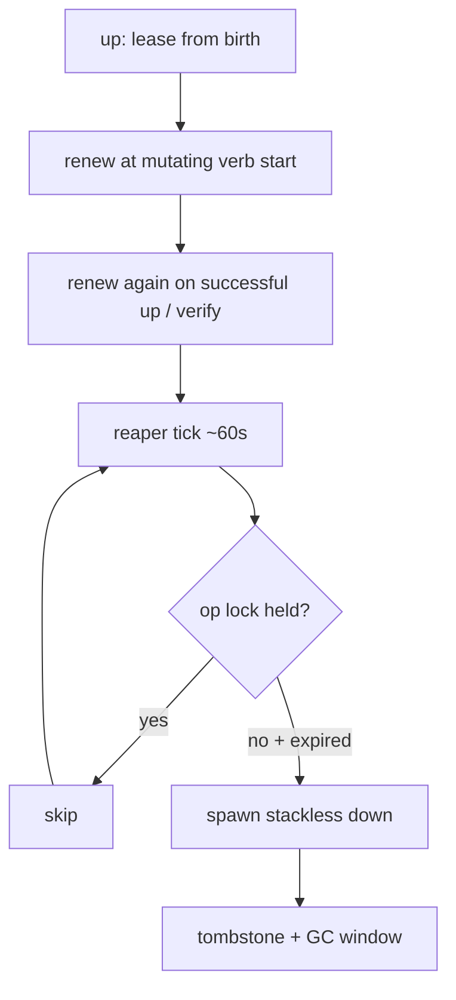
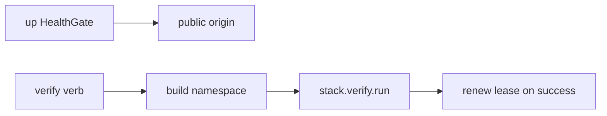
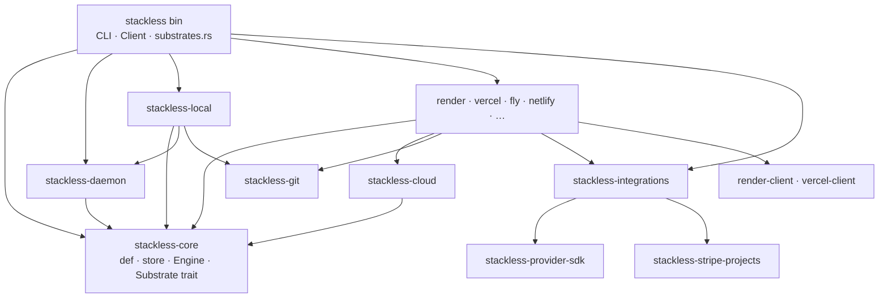

# stackless — architecture

Companion to [VISION.md](VISION.md). This document is the systems map: how
the binary is wired, how the lifecycle pipeline runs, and where each seam
lives. Schema detail lives in [docs/SCHEMA.md](docs/SCHEMA.md). Provider
onboarding is in [docs/ADDING-A-PROVIDER.md](docs/ADDING-A-PROVIDER.md).
Code comments cite sections as `ARCHITECTURE.md §N` — section numbers are
stable.

Nothing here is speculative. §5 is explicitly phased/TBD; everything else
is decided and reflected in the workspace.

---

## System map

**Layers.** CLI and SDK clients submit lifecycle requests to the controller.
The controller persists each operation, resolves secrets, builds its substrate,
and runs the engine. The engine plans steps, checkpoints, and reconciles through
`observe`. Substrates own materialization, hooks, start, and health. Integrations
call Stripe Projects. The controller hosts all substrates, the local proxy,
process bookkeeping, and lease enforcement. See [the operation contract](docs/CONTROLLER.md).

### End-to-end `up` pipeline

Step kinds, in plan order per dependency-graph topo node
(`engine/plan.rs`):

| `StepKind` | Prefix | Role |
|---|---|---|
| `ProvisionIntegration` | `integration:` | catalog resource for each integration |
| `Materialize` | `materialize:` | source checkout or source-ref journal |
| `Setup` | `setup:` | once-ish toolchain/deps (if declared) |
| `Prepare` | `prepare:` | every `up`, deps ready → before start |
| `Start` | `start:` | process / cloud deploy |
| `HealthGate` | `health:` | public-origin health |

There is no separate resume verb: `up` on an existing name resumes.
Recorded steps whose `observe` returns `Present` are skipped.

`down` runs the journal in reverse (`destroy` + `observe` survivors) and
tombstones the instance. `verify` is outside the plan — see §7.

---

## 0. Posture (v0)

v0 ships the lifecycle layer in the system map above. Destination trust
boundary work (§5) stays additive.

- **Rust core, pluggable provisioning.** One workspace, one `stackless`
  binary. The core owns identity, state, lifecycle, wiring, verification,
  leases, and teardown. Substrate backends may drive external CLIs where
  those earn their keep — the Stripe Projects CLI is the internal catalog
  driver for cloud provisioning and spend tracking. Each cloud substrate
  also talks to the provider's REST API for what Stripe Projects cannot
  express: interpolated env vars, deploy triggers, deploy polling, health
  waits, and teardown verification. Operators never declare "use Stripe
  Projects" in `stackless.toml` — stackless always does when a catalog
  resource is needed.
- **The trust boundary is sequenced, not shipped, in v0.** Default-deny
  egress and secret blinding remain the destination (VISION.md), but v0
  keeps the seam: every resource an instance owns is named and labeled
  with the instance name, so wrapping an instance in its own network later
  is an addition, not a redesign.
- **v0 secrets posture:** secrets flow as env vars, sourced from the
  Stripe Projects vault / pulled env files, visible to the operator,
  protected by being test-scoped credentials.

---

## 1. Stack definition

The definition subsystem turns `stackless.toml` into an ordered step plan.
Full field reference: [docs/SCHEMA.md](docs/SCHEMA.md).

Decided:

- **Format: TOML**, in a `stackless.toml`. The schema is deliberately
  shallow; serde + comments fit Rust-native culture.
- **A service is substrate-independent identity + wiring + health**; how
  a substrate runs it is nested per substrate (`[services.api.local]`,
  `[services.api.render]`, `[services.web.vercel]`, …).
- **Code sources are git references** (`repo` + `ref` per service). `up`
  materializes each service's source into instance-owned space. A
  per-invocation `--source` pin uses an existing checkout — local-only;
  cloud substrates deploy committed refs, so `--source` with
  `--on render|vercel|…` fails validation. With `--source … --dirty`,
  each pin's working tree is snapshotted as a content-addressed synthetic
  commit in instance-owned space. Bare `--source` uses the checkout in
  place (single active instance per path). On Vercel, `source.repo` must
  be a public GitHub HTTPS remote.
- **Output dependencies differ from readiness dependencies.** Integration
  references require provisioning. Native origins and dynamic endpoint URLs
  require start output when the provider cannot supply them early. Declared
  endpoint URLs are available before startup. `depends_on` separately gates
  consumers on started, ready, or completed. Named aliases preserve native
  origins and never imply provisioned custom-domain routing.
- **Two optional per-service lifecycle hooks.** `setup` runs after
  materialization (toolchain, deps). `prepare` runs on every `up`, after
  dependencies are ready and before the service starts (migrations, seed).
  On cloud substrates, both hooks execute on the operator's machine from
  a saved source working copy with application env exported. Hook revisions
  include the snapshot identity, so setup initializes each new working copy
  even when its Git commit is unchanged. A host-execution
  grant is required. Each hook in an accepted operation records its own command resource.
  The process waits behind a gate until its identity is committed. Recovery
  waits for that process; changed inputs cannot launch a replacement. Output
  retention is capped at 64 KiB. The workload deadline also runs outside the
  controller. Teardown stops the command before deleting its source or parents.
  New operations can run the hook again, so hooks must tolerate repeated use.
- **Local finite commands own their execution receipts.** Shell jobs, setup,
  and prepare store a `local-job` resource before releasing the process gate.
  The watchdog enforces the deadline while the daemon is dead. Recovery reads
  the same receipt and rejects changed inputs within the operation. Failed
  output remains available through `logs`, capped at 64 KiB per execution and
  redacted on read. Teardown validates the owner and workspace marker before
  stopping the command and removing its files. Legacy receipts keep their
  original process identity and lack the independent watchdog.
- **Host services retain bounded logs outside the controller.** A gated internal
  CLI runner owns each new service generation. Its PID, start time, and cookie
  are committed before launch. It writes combined output into three 1 MiB log
  generations and keeps collecting through controller death. Read tails span
  rotations and redact recorded env values. Teardown allows shutdown output,
  then removes surviving processes by recorded identity and exact cookie. A dead
  runner with surviving helpers is drift. Legacy direct-log services retain
  their old behavior until replaced.
- **Health gates `up`; `verify` proves.** Every service declares a
  `health` check; `up` refuses success until all pass. The stack declares
  one `verify` command (named tiers can be added later) run by the
  `verify` verb with origins/env exported.
- **Hosted integrations separate logical name from catalog provider.**
  `[integrations.<name>]` is the interpolation slot
  (`${integrations.<name>.<output>}`); `provider` names the catalog
  adapter. Each provider declares **managed** (global config only) or
  **host-bound** (tied to stack hosts). Provider config is validated by
  `stackless-integrations`; `${integrations.*}` references are ordering
  edges.

### The interpolation namespace

| Reference | Resolves to | Notes |
|---|---|---|
| `${stack.name}` | the stack's declared name | useful for hosted integration names |
| `${instance.name}` | the instance's name | the one identity everything derives from |
| `${services.X.origin}` | substrate-appropriate origin | local: `http://x.{instance}.localhost:<port>`; Render: `https://{stack}-{instance}-x.onrender.com`; Vercel: deployment URL after `start`. Late-bound origins require start output |
| `${endpoints.X.url}` | declared URL or provider origin for its workload | declared URLs have unknown readiness; dynamic bindings follow workload readiness |
| `${secrets.KEY}` | resolved secret value | `secrets.required` injects same-named vars |
| `${integrations.X.<output>}` | provider output | from integration checkpoint payloads |
| `$PORT` | OS-allocated port | injected into local `run` only — not interpolation |

Resolution rules: substrate `env` overlays the common `env`; references
to anything undeclared fail validation at parse time, not at `up` time.

Lease duration and dirty source overrides are invocation options. Workloads,
container images, jobs, endpoints, and explicit readiness dependencies belong to
the definition. `on` selects each workload or resource's hosting adapter. A
`RoutedSubstrate` composes the registered adapters under one engine and uses
persisted placement for old receipts. Live or unfinished resources cannot change
adapters. Provider capabilities reject unsupported execution before admission. See [execution contracts](docs/EXECUTION.md).

**Secrets resolution.** When `[stack.projects.stripe].project` is
recorded, stackless pulls the Stripe Projects vault as the base; a
gitignored `.stackless.env` next to `stackless.toml` overlays it (file
wins). Stacks whose workloads are all local, without catalog resources or a Stripe
anchor, stay env-file-only. A
`required` key that resolves from neither fails before anything
provisions. `stackless doctor` runs `stripe projects --preflight` to
surface auth/ToS/provider-link blockers before `up`.

---

## 2. CLI surface, instance identity & state

The control plane: verbs, identity, locks, and the durable journal.

Decided:

- **Verbs.** `up [--name]`, `down`, `verify`, `status`, `list`, `logs`
  (local: daemon-captured file output; cloud: recent API window via
  `render_api` / `vercel_api` / `fly_events` /
  `railway_api` / `wordpress_api` /
  `laravel_cloud_api` / `gitlab_api`). `up` on an existing instance
  resumes. **`--name` is optional at creation** (`{stack.name}-{uuid}`
  when omitted). **The substrate is chosen at creation only**
  (`--on local|render|vercel|fly|netlify|railway|cloudflare|wordpress|
  laravel-cloud|gitlab`), becomes part of instance identity, and is
  never asked again. Names are unique across substrates in the state
  store. `up --on <s>` fails if any service lacks that substrate's
  config. All commands are non-interactive, support `--json`, and use
  agent-branchable exit codes. Anything that spends money requires
  `--confirm-paid`.
- **One operation at a time per instance.** Mutating verbs take a
  controller queue. Database claims carry a unique token and PID/start time;
  overlapping engine calls cannot share a claim. The reaper submits to this queue.
- **Parallel `up` across different names** is supported. Cross-process
  file locks serialize shared writers: Stripe Projects CLI invocations
  keyed by `definition_dir`, and bare git cache clone/fetch keyed by
  source URL. Parallel agents should use one git worktree each; bare
  `--source` on multiple active instances is refused — use `--dirty` or
  distinct checkouts.
- **Provider CLI deadlines survive controller death.** The internal CLI helper
  acquires the Stripe command lock and acknowledges it before the caller releases
  the command. It holds that lock through the command's deadline, bounded output
  capture, and cleanup. Runtime snapshot replacement waits for the lock, and GC
  defers while it is held. Process cleanup suspends owned parents before killing
  children, preventing a shell from continuing after its sleep is killed.

- **Errors are an agent-facing contract.** Every error carries *what*
  failed, *why*, and *how to proceed*. In `--json` mode:
  `schema_version`, stable `code`, optional `step`/`instance`, `context`,
  `remediation`. Agents branch on codes, never prose. **stdout** carries
  final envelopes; **stderr** carries NDJSON `up` progress in `--json`
  mode.
- **Identity.** Every birth has an immutable instance ID and resource namespace.
  The DNS-safe display name can be reused after verified teardown. Resource
  ownership and recovery use the recorded birth identity.
- **State: a SQL state store.** Instance records, leases, operation
  claims, resource inventory, durable operations, events, and checkpoints live
  in SQLite under the per-user XDG state dir. The controller owns lifecycle
  writes. The direct remote database driver is removed; remote clients use the
  controller transport. Exported legacy schemas convert transactionally on open
  without dropping checkpoint or resource evidence. Terminal request bodies expire
  after seven days once their birth has been collected and its resources are
  absent. Request digests preserve idempotent submission after input collection.
- **Teardown leaves a tombstone.** After verified `down`/reap, rows flip
  to tombstone and logs survive a GC window; billable resources are gone.
- **Resume reconciles against observation.** On resume, each recorded
  step is re-checked via `substrate.observe` — the manifest says where to
  look; the substrate says what's true.

### On-disk layout

Definition-dir sidecars (not in XDG): `.stackless.env`, Stripe
`.projects/`, pulled `.env` / `.env.<instance>`.

---

## 3. Local substrate

App services run as host processes from commands in the definition.
Toolchain provisioning is the repo's business (`setup` hooks). Everything
meets at `localhost` ports allocated per instance; the built-in reverse
proxy plays the portless role so origins derive from the instance name
alone.

- **Schema separates what a service *is* from how a substrate *runs*
  it.** A container `image:` runner can be added later without breaking
  definitions written today.
- **Teardown is verified:** SIGTERM then SIGKILL on the process group,
  confirmed dead by PID + start time; proxy route withdrawn. `down` exits
  non-zero listing survivors if anything remains. Then tombstone (§2).

Rationale for host processes over containers-only: the container-build
penalty on macOS is paid on every agent cycle, while the fidelity
containers would buy is exactly what cloud substrates exist to prove.

### The controller daemon

One resident component per user hosts everything that must outlive a CLI
invocation: lifecycle operations, reverse proxy, process bookkeeping, and lease
enforcement for local and cloud substrates. The operator must remain awake
for cloud lease enforcement; always-on remote hosting remains unfinished.

- **Same binary.** `stackless` running internal `daemon run`. The Rust
  SDK's `Client::system()` resolves that CLI via `STACKLESS_BIN` / `PATH`.
- **Spin-up on demand.** Commands connect to a unix socket in the state
  dir; if nothing answers, the CLI spawns the daemon under a lock and
  waits. No setup step.
- **Boot persistence.** On first start the daemon registers as a launchd
  user agent (macOS) / systemd user unit (Linux). If registration is
  refused, stackless degrades loudly: leases are enforced only while the
  daemon happens to be running, and `status` says so.
- **Instance processes survive controller restarts.** Each gets its own process
  group. The controller records PID and start time before releasing user code,
  and can adopt the process after restart. Output goes to service log files.
- **Upgrade = restart + re-adopt.** For dist installs, CLI self-update
  (axoupdater + re-exec) precedes the existing drain/re-adopt handshake.
  Socket handshake carries version; newer CLI drains older daemon.
  Starting daemon reconciles manifests against observed reality —
  re-adopting live processes, noting dead ones.
- **v0 supervision: observe, don't restart.** A crashed service marks the
  instance unhealthy; agents re-run `up` to recover.

### Ports, origins, routing

- **HTTP-only proxy in v0**, one fixed unprivileged port (configurable
  globally, never per instance): origins stay
  `http://{service}.{instance}.localhost:<port>`. TLS mode is a later
  opt-in.
- **One service may declare `root_origin`** and also claim
  `http://{instance}.localhost:<port>`.
- **Ports are OS-allocated at `up`** (bind `:0`) and injected as `$PORT`.
- **Routes on the Host header** from a table the daemon updates as
  instances come and go.

---

## 4. Cloud substrates

All cloud substrates share one pattern: **Stripe Projects provisions and
tracks spend; the provider REST API operates** (env, deploy, poll,
health, teardown verify). Shared helpers live in `stackless-cloud`
(prepare, health, credentials, checkpoints). Registration is one row in
`crates/stackless/src/substrates.rs`.

Shared rules:

- **One long-lived Stripe project per stack** holds hosted integrations
  and cloud instances as named environments. Project id is recorded at
  `[stack.projects.stripe].project` after first creation.
- **Per-instance resource names:** `{stack}-{instance}-{service}`,
  DNS-safe by construction (§2).
- **Sequencing:** provision integrations → `prepare` on the operator
  machine → push env → deploy → health gate.
- **Intent precedes side effects.** Returned native handles are recorded before
  configuration and readiness. Checkpoints record completed steps; unfinished
  inventory remains available to recovery and teardown.
- **Teardown is verified, dependents-first**; exit non-zero if anything
  that bills or holds state remains. Spend is printed after cloud `up` /
  `down`.
- **Recovery combines separate evidence.** The controller inventory records
  ownership and intent. Stripe reports catalog registration. Native provider
  APIs establish deployment state and absence. Failed observations retain
  ownership until cleanup can be verified.
- **Paid tiers are never auto-confirmed** — `--confirm-paid` per
  invocation, backed by hard per-provider spend caps on the stack
  project.
- **No root-origin alias on cloud**; each service keeps its own public
  URL. Setup and prepare run on the operator machine from the saved source
  working copy. Provider build commands remain separate deployment settings.
- **Plugin surface** pinned via committed snapshots in
  `crates/stackless-stripe-projects/tests/fixtures/` (nightly watcher
  opens upgrade PRs).

### 4a. Render

- Catalog: `render/web-service` or `render/static-site` from
  `[services.X.render]`.
- Stripe provisions; Render REST fills env, SPA rewrite, deploy trigger,
  deploy polling (Rust release builds can take 30+ minutes on small
  tiers), health wait. API key from env or scoped key file.
- `stackless logs` fetches a recent per-service window via the Render
  API (`source: "render_api"`; no streaming).

### 4b. Vercel

- Catalog: `vercel/project` (`{"name": …}`); optional stack-level
  `vercel/pro` when `[stack.vercel].plan = "pro"`.
- After Stripe links the project: push env, git deployment from pinned
  `ref` + `[services.X.vercel]` build settings, poll until `READY`,
  health-gate on deployment URL. Token: `VERCEL_TOKEN` or `.vercel-token`.
- `stackless logs` fetches deployment build events via the Vercel API
  (`source: "vercel_api"`; recent window, no streaming).

### 4c. Fly

- Catalog: `flyio/app` (usage-billed → always `--confirm-paid`). App name
  = resource name (Fly naming rules).
- Two deploy paths: common `image` or `[services.X.fly].image` (Machines API) or
  source-build via `flyctl deploy --remote-only` when `image` is omitted
  (optional `dockerfile`; requires `fly`/`flyctl` on PATH). Smokes:
  `smoke-fly` (image) and `smoke-fly-build` (source-build). Source builds extract
  a durable archive at `source.root`; Dockerfile paths are relative to that root.
  Prepare uses a separate working copy. Generated Fly config and CLI home remain
  outside the uploaded context. Builder process identity and deadline commit
  before release. Recovery waits for that process; output is capped at 64 KiB.
- Fly workers support both image and source-build deployment. Workers without
  HTTP health omit services, public-IP allocation, and origins. Their restart
  policy is `always`; readiness observes the owned machine again after start.
  Workers with explicit HTTP health retain a listener. Finite jobs remain unsupported.
- Images need no Git source or provider block. Common `run` maps to `init.exec`
  through `/bin/sh -c`; `PORT` defaults to the configured internal port.
  Source-free setup, prepare, and verification use recorded empty snapshots.
- Stripe provisions the app. Catalog and native journals persist app identity,
  IP-allocation intent, and machine submission receipts. Recovery requires the
  recorded machine ID or one exact receipt. Image revisions update that machine;
  source revisions restrict flyctl to it. Readiness checks configuration, image
  digest, started state, and the app's complete machine inventory.
- Native app deletion verifies absence before catalog removal. App ID and
  organization mismatches retain ownership. Recorded local builders stop before
  app deletion. Fly's remote builder ownership, failed-build retry generations,
  and live provider conformance remain required.
- `stackless logs` fetches machine events via the Fly Machines API
  (`source: "fly_events"`; recent window, no streaming).

### 4d. Netlify

- Catalog: `netlify/project` (free — no `--confirm-paid`).
- Two deploy paths: file-digest static upload (fast path when `build` is
  absent) or build settings (`build` / `install` / `root` / `publish`) with
  zip-upload to the build API (`deploy = "build"`) or git-linked
  `createSiteBuild` (`deploy = "git"`). Smokes: `smoke-netlify` (static)
  and `smoke-netlify-build` (build API).
- Stripe provisioning and native requests share an owned inventory record.
  Deployments carry persisted receipts in `title`. Recovery scans all pages or
  reads a saved build ID, then verifies the exact deployment and site.
- Readiness requires the recorded deployment to reach `ready` with a provider
  endpoint. Teardown verifies native site absence before catalog removal.
  Failed responses retain both native and catalog cleanup information.
- Runtime logs are unsupported. Deployment metadata is not log output.
- Git builds still follow a branch. Prepare uses the shared durable snapshot and
  command runner. Immutable Git deployment transport and verification remain required.

### 4e. Railway

- Catalog: `railway/hosting` from `[services.X.railway]`.
- Two deploy paths: common `image` or `[services.X.railway].image` (GraphQL image deploy;
  optional `cmd`) or GitHub HTTPS `source.repo` when `image` is omitted.
  Git refs resolve to durable snapshots. Deployment sends the saved commit SHA;
  prepare uses a separate working copy at `source.root`.
- Images need no Git source or provider block. Common `run` maps to a quoted
  `/bin/sh -c` start command. Command arrays preserve each argument boundary.
  Source-free setup, prepare, and verification use recorded empty snapshots.
- Stripe provisions; Railway GraphQL creates project/service, deploys,
  attaches a public domain, health-gates on the live origin. Deploy token
  from Stripe instance env (`RAILWAY_TOKEN` / `RAILWAY_API_TOKEN`) or
  `.railway-token`. Native project/service receipts and mutation intents persist
  with catalog ownership. Returned IDs survive restart; an unknown deployment
  submission blocks another POST. Observation verifies ownership, configuration,
  domain, commit, and active deployment. Teardown requires a matching native
  deletion record before catalog removal. Tombstone visibility, source-connection
  auto-deploy behavior, and live conformance remain unverified.
- `stackless logs` fetches a recent deployment/build window via Railway
  GraphQL (`source: "railway_api"`; no streaming).

### 4f. Cloudflare Workers (`--on cloudflare`)

- Catalog: `cloudflare/workers` per deployable service. **Distinct from**
  Cloudflare catalog *integrations* (`cloudflare-r2`, `cloudflare-kv`,
  …) which run under `--on local` and are covered by
  `smoke-cloudflare-integrations`; substrate coverage is
  `smoke-cloudflare-workers`.
- Deploy: clone the pinned ref; upload `worker.js` / `worker.mjs` under
  `[services.X.cloudflare].root` when present, otherwise embed
  `index.html` in a generated module Worker. Scripts API upload →
  health-gate on `*.workers.dev`.
- Stripe provisions; deploy uses `CLOUDFLARE_API_TOKEN` (Stripe env,
  secrets, or `.cloudflare-api-token`). `observe`/`down` key off Stripe.
- `stackless logs` fetches recent Workers script/deployment events
  (`source: "cloudflare_api"`; no streaming).

### 4g. WordPress.com

- Catalog: `wordpress.com/site` from `[services.X.wordpress]` (optional
  `plan`, `root`).
- Stripe provisions the site. Native publication consumes sealed HTML under
  `source.root` or `wordpress.root`. Revision receipts recover lost page-create
  responses. Readiness verifies page content, homepage settings, and a marker
  in the public homepage. Recorded pages can be repaired after content drift.
- Token: `WORDPRESS_COM_ACCESS_TOKEN`, `WORDPRESS_ACCESS_TOKEN`, or
  `.wordpress-com-token`. Teardown retains the native ID through catalog
  subscription removal and verifies site absence. Domain purchase
  (`wordpress.com/domain`) is excluded.
- `stackless logs` fetches a recent site activity window
  (`source: "wordpress_api"`; no streaming).

### 4h. Laravel Cloud

- Catalog: `laravel_cloud/application` from
  `[services.X.laravel-cloud]` (`repository`, region, …).
- Stripe provisions `app_id`. Native readback checks application identity,
  repository, root, and the explicit default environment before deploying.
  Deployment readiness checks the returned commit and current-deployment pointer.
  Catalog and native journals retain application and deployment IDs across
  retries. Unknown POST outcomes block resubmission. Commit-pinned submission
  and recovery of an unreturned deployment ID remain unfinished.
- Laravel Cloud JSON:API resolves the
  environment, POST `/environments/{id}/deployments`, polls to
  `deployment.succeeded`, health-gates on the app origin. Token:
  `LARAVEL_CLOUD_API_TOKEN` or `.laravel-cloud-token`.
  Native observation checks the current deployment. `down` verifies application
  absence before removing the Stripe registration.
- `stackless logs` fetches recent deployment log lines
  (`source: "laravel_cloud_api"`; no streaming).

### 4i. GitLab

- Catalog: `gitlab/project` from `[services.X.gitlab]` (optional
  `visibility`, `root`).
- Stripe provisions; GitLab REST commits static files under `public/`
  from `[services.X.gitlab].root`, installs a Pages CI job
  (`.gitlab-ci.yml`), polls the `pages` job (~15m budget), health-gates
  on the public Pages URL. Token: `GITLAB_TOKEN` /
  `GITLAB_ACCESS_TOKEN` or `.gitlab-token`. Native commit receipts, pipeline/job
  IDs, and repair generations persist with catalog ownership. Deployment replaces
  managed Pages files, removes stale assets, and checks the branch tip and public
  serving receipt. A completed deployment can create a new repair generation;
  an unfinished submission resumes its existing receipt. Teardown verifies native
  Pages/project absence before removing Stripe registration.
- `stackless logs` fetches recent Pages/CI job log lines
  (`source: "gitlab_api"`; no streaming).

---

## 5. Trust boundary (phased, post-v0) — TBD

Recorded from design discussion, to be developed when sequenced:

- Two separable jobs: (1) default-deny egress — an SNI-passthrough
  gateway on a per-instance network, no MITM, no app changes; (2) secret
  blinding — token→real-value swap at egress.
- Two-class secret model: **instance-minted** secrets (DB passwords,
  per-instance keys) are protected by leasing alone — they die with the
  instance and are useless outside it; blinding them buys nothing.
  **Third-party durable** secrets are the dangerous class and the only
  candidates for blinding.

---

## 6. Leases & the reaper

The reaper lives in the local daemon (§3) and enforces leases for
instances on **all** substrates through the same teardown path `down`
uses. Known gap: if the operator's machine is off/asleep past a cloud
lease's expiry, the instance outlives its lease until wake (the daemon
reaps overdue leases immediately on start/wake). A substrate-side
backstop is a candidate for later.

Lease semantics:

- **Every instance carries a lease from birth** — `--lease <duration>` at
  `up`, with per-substrate defaults (local: 24h; cloud: typically 8h).
- **The lease renews to its full duration at the start of every mutating
  verb, and again on a successful `up` or `verify`.** Traffic does not
  renew. No separate renew verb in v0. Consent at creation covers
  renewals; spend caps (§4) bound total exposure.
- **The reaper never reaps an instance holding its operation lock.** A
  failed reap retries with backoff and surfaces in `list`/`status`.
- **`list` shows remaining lease** for every instance.

---

## 7. Health & proof

- **HTTP health checks run through the instance's public
  origin** — locally the proxy; on cloud the provider URL — never the
  raw port, so routing is part of what "healthy" proves. Shape:
  `health = { path, status = 200, contains = "..." }` with a retry
  budget defaulting per substrate (seconds locally; minutes against a
  cold cloud deploy).
- **TCP health checks** connect to the recorded local listener port. The shape
  is `health = { protocol = "tcp" }`. Connection success proves a listener;
  dependent jobs or verification establish application protocol behavior.
  TCP does not register HTTP routes. Cloud and container TCP admission is
  rejected until those routing paths are implemented and tested.
- **`up` reports staged truth:** provisioned → configured → prepared →
  started → healthy, each stage gated on the previous. `status` shows the
  stage an instance actually reached, per service. Current observations separate
  existence, configuration, and readiness. Failed observations remain unknown.
  Status also exposes retained inventory metadata for unfinished operations and
  removed workloads, without provider payloads or credentials.
- **`verify` runs the stack's verify command** with env built by the same
  interpolation mechanism services use (`[stack.verify]` has `run` and
  `env` with `${...}` references). Each operation and tier owns a gated command
  receipt. `timeout_secs` defaults to 300 and runs outside the controller.
  Recovery reconnects to the same process; cancellation stops it. Output is
  capped at 64 KiB and retained through failure until teardown. The command
  depends on the existing resource inventory, so teardown stops verification
  before removing its source and prerequisites. It renews the lease on entry
  and success. Older unjournaled verification operations remain interrupted.

---

## 8. Crate layout

One Cargo workspace; seams mirror the load-bearing boundaries so each
substrate compiles and tests in isolation.

**Ground rule:** `stackless-core` never names a substrate. The binary
registers hosting providers in `substrates.rs` (one row + crate).
Integrations register via `Hostable` / `ProviderOps` in
`stackless-integrations`. See [docs/ADDING-A-PROVIDER.md](docs/ADDING-A-PROVIDER.md).

Workspace conventions:

- **Parsing/CLI foundations are pinned:** `toml` + serde for
  `stackless.toml`; `clap` (derive) for the CLI.
- **Errors are `thiserror` enums end-to-end — no `anyhow`.** Every error
  must carry its stable code, step/instance context, and remediation to
  the agent-facing envelope (§2). A new error variant is only complete
  when its remediation says what the operator should actually do.

| Crate | Role |
|---|---|
| `stackless-core` | Definition model (serde, validation, interpolation, derived graph), SQL state store, lifecycle engine (`plan` / execute / checkpoint / observe). Defines the `Substrate` trait. |
| `stackless-local` | Local `Substrate`: process spawn/adoption, port allocation; materialization via `stackless-git`. |
| `stackless-git` | Pure-Rust git (`grit-lib`): bare cache + alternates checkout for local; sealed Git snapshots for cloud hooks and deployment; `snapshot_worktree` for `--dirty`. |
| `stackless-daemon` | Unix-socket RPC, process bookkeeping, reaper tick, Host-header reverse proxy. |
| `stackless-cloud` | Shared cloud scaffolding: prepare hooks, health poll, credentials, checkpoint helpers. |
| `stackless-stripe-projects` | Neutral Stripe Projects CLI driver: project anchor, environments, catalog add/remove, env materialization, spend caps. |
| `stackless-integrations` | Hosted integration routing + provider adapters; substrates call provision/observe/destroy. |
| `stackless-provider-sdk` | Extension traits: `Hostable`, `ProviderOps`, `CatalogResource`. |
| `stackless-render` / `-vercel` / `-fly` / `-netlify` / `-railway` / `-cloudflare` / `-wordpress` / `-laravel-cloud` / `-gitlab` | Cloud `Substrate` impls. |
| `render-client` / `vercel-client` | Generated REST clients from vendored OpenAPI (`specs/regen-clients.sh`); opt out of workspace lints. |
| `stackless-idl` / `stackless-bindgen` | Language-neutral stack IDL + checked-in bindings helper. |
| `stackless` | Clap CLI, sync `Client`, substrate registry, daemon spawner, human/`--json` output. |
| `xtask` | Provider onboarding: `catalog`, `discover`, `new-integration`. |

The engine is shared by `up`, resume, daemon adoption, and the reaper —
they are the same machinery, not parallel lifecycle implementations.
