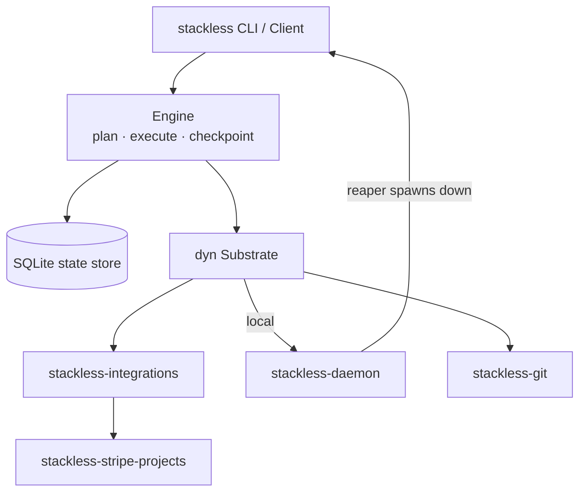
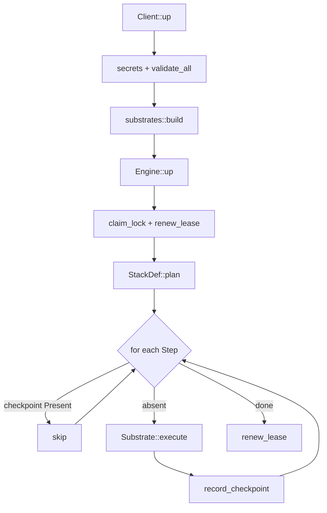
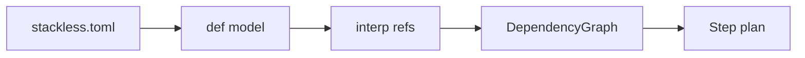
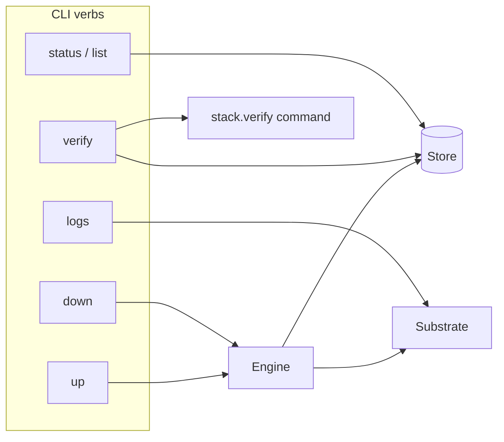
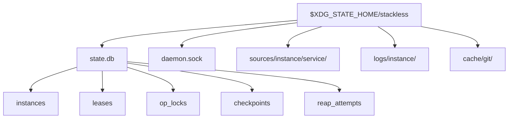
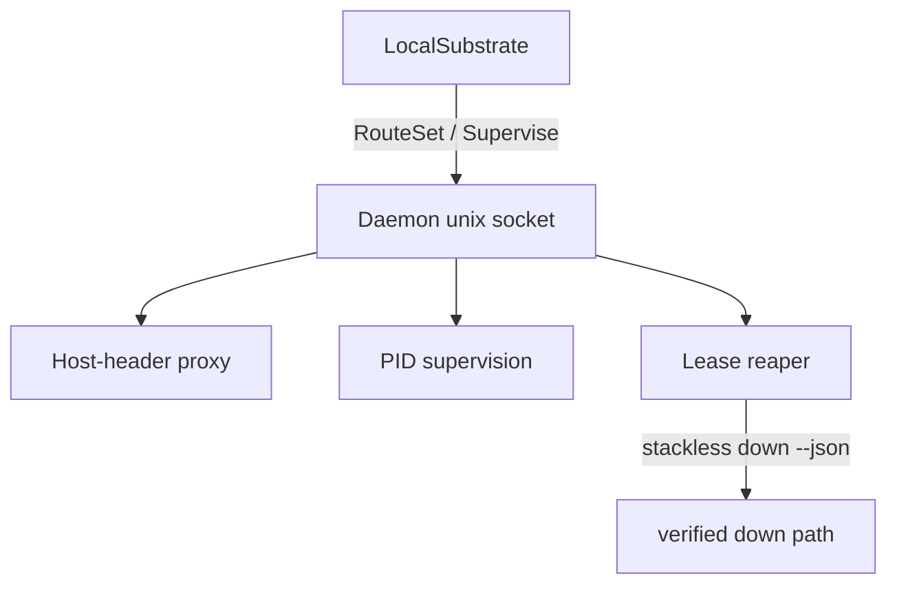
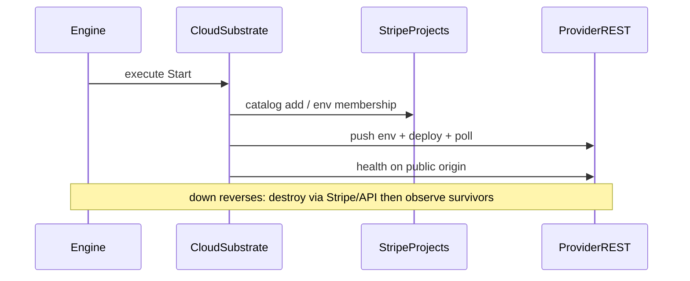
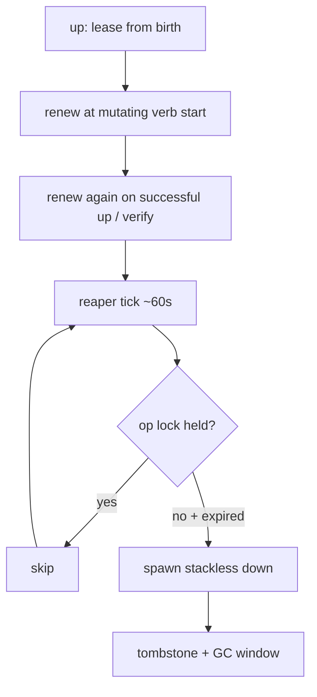
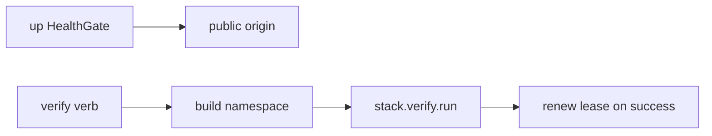
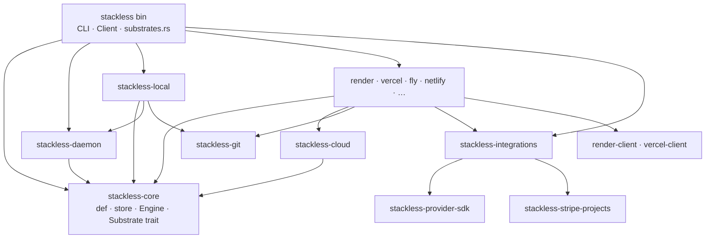

# stackless — architecture

Companion to [VISION.md](VISION.md). This document is the systems map: how
the binary is wired, how the lifecycle pipeline runs, and where each seam
lives. Schema detail lives in [docs/SCHEMA.md](docs/SCHEMA.md). Provider
onboarding is in [docs/ADDING-A-PROVIDER.md](docs/ADDING-A-PROVIDER.md).
Code comments cite sections as `ARCHITECTURE.md §N` — section numbers are
stable.

Nothing here is speculative. §5 is explicitly phased/TBD; everything else
is decided and reflected in the workspace.

---

## System map

**Layers.** The CLI/`Client` opens the store, resolves secrets, builds a
substrate from the binary registry, and drives the engine. The engine is
substrate-agnostic: it plans steps, checkpoints, and reconciles via
`observe`. Substrates own materialization, hooks, start, and health.
Integrations are not substrates — substrates call
`stackless-integrations` for provision/observe/destroy, which drives the
Stripe Projects catalog. Only the local substrate needs the daemon
(proxy, supervision, reaper host).

### End-to-end `up` pipeline

Step kinds, in plan order per dependency-graph topo node
(`engine/plan.rs`):

| `StepKind` | Prefix | Role |
|---|---|---|
| `ProvisionIntegration` | `integration:` | catalog resource for each integration |
| `Materialize` | `materialize:` | source checkout or source-ref journal |
| `Setup` | `setup:` | once-ish toolchain/deps (if declared) |
| `Prepare` | `prepare:` | every `up`, deps ready → before start |
| `Start` | `start:` | process / cloud deploy |
| `HealthGate` | `health:` | public-origin health |

There is no separate resume verb: `up` on an existing name resumes.
Recorded steps whose `observe` returns `Present` are skipped.

`down` runs the journal in reverse (`destroy` + `observe` survivors) and
tombstones the instance. `verify` is outside the plan — see §7.

---

## 0. Posture (v0)

v0 ships the lifecycle layer in the system map above. Destination trust
boundary work (§5) stays additive.

- **Rust core, pluggable provisioning.** One workspace, one `stackless`
  binary. The core owns identity, state, lifecycle, wiring, verification,
  leases, and teardown. Substrate backends may drive external CLIs where
  those earn their keep — the Stripe Projects CLI is the internal catalog
  driver for cloud provisioning and spend tracking. Each cloud substrate
  also talks to the provider's REST API for what Stripe Projects cannot
  express: interpolated env vars, deploy triggers, deploy polling, health
  waits, and teardown verification. Operators never declare "use Stripe
  Projects" in `stackless.toml` — stackless always does when a catalog
  resource is needed.
- **The trust boundary is sequenced, not shipped, in v0.** Default-deny
  egress and secret blinding remain the destination (VISION.md), but v0
  keeps the seam: every resource an instance owns is named and labeled
  with the instance name, so wrapping an instance in its own network later
  is an addition, not a redesign.
- **v0 secrets posture:** secrets flow as env vars, sourced from the
  Stripe Projects vault / pulled env files, visible to the operator,
  protected by being test-scoped credentials.

---

## 1. Stack definition

The definition subsystem turns `stackless.toml` into an ordered step plan.
Full field reference: [docs/SCHEMA.md](docs/SCHEMA.md).

Decided:

- **Format: TOML**, in a `stackless.toml`. The schema is deliberately
  shallow; serde + comments fit Rust-native culture.
- **A service is substrate-independent identity + wiring + health**; how
  a substrate runs it is nested per substrate (`[services.api.local]`,
  `[services.api.render]`, `[services.web.vercel]`, …).
- **Code sources are git references** (`repo` + `ref` per service). `up`
  materializes each service's source into instance-owned space. A
  per-invocation `--source` pin uses an existing checkout — local-only;
  cloud substrates deploy committed refs, so `--source` with
  `--on render|vercel|…` fails validation. With `--source … --dirty`,
  each pin's working tree is snapshotted as a content-addressed synthetic
  commit in instance-owned space. Bare `--source` uses the checkout in
  place (single active instance per path). On Vercel, `source.repo` must
  be a public GitHub HTTPS remote.
- **Wiring is interpolation; the dependency graph is derived from it.**
  Env values reference a namespace evaluated per instance per substrate.
  If service A's env references an integration, that *is* an ordering
  edge. `${services.X.origin}` is recorded as wiring but is **not** a
  topo edge — origins are derivable from the instance name alone on
  local/Render (Vercel uses the deployment URL after `start`), so mutual
  CORS references (api ↔ web) are not cycles. No separate `depends_on`.
- **Two optional per-service lifecycle hooks.** `setup` runs after
  materialization (toolchain, deps). `prepare` runs on every `up`, after
  dependencies are ready and before the service starts (migrations, seed).
  On cloud substrates, `prepare` executes on the operator's machine from
  materialized source with the instance env exported. Both hooks are
  contractually safe to re-run.
- **Health gates `up`; `verify` proves.** Every service declares a
  `health` check; `up` refuses success until all pass. The stack declares
  one `verify` command (named tiers can be added later) run by the
  `verify` verb with origins/env exported.
- **Hosted integrations separate logical name from catalog provider.**
  `[integrations.<name>]` is the interpolation slot
  (`${integrations.<name>.<output>}`); `provider` names the catalog
  adapter. Each provider declares **managed** (global config only) or
  **host-bound** (tied to stack hosts). Provider config is validated by
  `stackless-integrations`; `${integrations.*}` references are ordering
  edges.

### The interpolation namespace

| Reference | Resolves to | Notes |
|---|---|---|
| `${stack.name}` | the stack's declared name | useful for hosted integration names |
| `${instance.name}` | the instance's name | the one identity everything derives from |
| `${services.X.origin}` | substrate-appropriate origin | local: `http://x.{instance}.localhost:<port>`; Render: `https://{stack}-{instance}-x.onrender.com`; Vercel: deployment URL after `start`. Mutual service refs are not topo edges |
| `${secrets.KEY}` | resolved secret value | `secrets.required` injects same-named vars |
| `${integrations.X.<output>}` | provider output | from integration checkpoint payloads |
| `$PORT` | OS-allocated port | injected into local `run` only — not interpolation |

Resolution rules: substrate `env` overlays the common `env`; references
to anything undeclared fail validation at parse time, not at `up` time.

Deliberately absent from the schema: lease duration (`--lease` flag with
substrate defaults), dirty-worktree override (per-invocation, local-only,
recorded in the manifest), `image:` runners and third-party egress
(reserved seams), and any `depends_on` key.

**Secrets resolution.** When `[stack.projects.stripe].project` is
recorded, stackless pulls the Stripe Projects vault as the base; a
gitignored `.stackless.env` next to `stackless.toml` overlays it (file
wins). Local-only stacks without a Stripe anchor stay env-file-only. A
`required` key that resolves from neither fails before anything
provisions. `stackless doctor` runs `stripe projects --preflight` to
surface auth/ToS/provider-link blockers before `up`.

---

## 2. CLI surface, instance identity & state

The control plane: verbs, identity, locks, and the durable journal.

Decided:

- **Verbs.** `up [--name]`, `down`, `verify`, `status`, `list`, `logs`
  (local: daemon-captured output; Render: recent REST window; Vercel/Fly/
  Netlify: not wired in v0 — use the dashboard). `up` on an existing
  instance resumes. **`--name` is optional at creation**
  (`{stack.name}-{uuid}` when omitted). **The substrate is chosen at
  creation only** (`--on local|render|vercel|fly|netlify|…`), becomes
  part of instance identity, and is never asked again. Names are unique
  across substrates in the state store. `up --on <s>` fails if any
  service lacks that substrate's config. All commands are
  non-interactive, support `--json`, and use agent-branchable exit codes.
  Anything that spends money requires `--confirm-paid`.
- **One operation at a time per instance.** Mutating verbs take a
  per-instance operation lock (PID + process start time); a second
  invocation fails fast. The reaper respects the lock (§6).
- **Parallel `up` across different names** is supported. Cross-process
  file locks serialize shared writers: Stripe Projects CLI invocations
  keyed by `definition_dir`, and bare git cache clone/fetch keyed by
  source URL. Parallel agents should use one git worktree each; bare
  `--source` on multiple active instances is refused — use `--dirty` or
  distinct checkouts.
- **Errors are an agent-facing contract.** Every error carries *what*
  failed, *why*, and *how to proceed*. In `--json` mode:
  `schema_version`, stable `code`, optional `step`/`instance`, `context`,
  `remediation`. Agents branch on codes, never prose. **stdout** carries
  final envelopes; **stderr** carries NDJSON `up` progress in `--json`
  mode.
- **Identity.** DNS-safe instance name, persisted in the manifest. Nothing
  is re-derived from the working directory at runtime.
- **State: a SQL state store.** Instance records, leases, operation
  locks, and the per-step checkpoint journal live in SQLite under the
  per-user XDG state dir. Local engine: `rusqlite` (bundled SQLite, WAL)
  — the `turso` crate's exclusive per-process file lock cannot serve
  concurrent CLI + daemon. Opt-in **fleet plane**: `libsql` remote mode
  for shared CAS leases/locks across operator machines.
- **Teardown leaves a tombstone.** After verified `down`/reap, rows flip
  to tombstone and logs survive a GC window; billable resources are gone.
- **Resume reconciles against observation.** On resume, each recorded
  step is re-checked via `substrate.observe` — the manifest says where to
  look; the substrate says what's true.

### On-disk layout

Definition-dir sidecars (not in XDG): `.stackless.env`, Stripe
`.projects/`, pulled `.env` / `.env.<instance>`.

---

## 3. Local substrate

App services run as host processes from commands in the definition.
Toolchain provisioning is the repo's business (`setup` hooks). Everything
meets at `localhost` ports allocated per instance; the built-in reverse
proxy plays the portless role so origins derive from the instance name
alone.

- **Schema separates what a service *is* from how a substrate *runs*
  it.** A container `image:` runner can be added later without breaking
  definitions written today.
- **Teardown is verified:** SIGTERM then SIGKILL on the process group,
  confirmed dead by PID + start time; proxy route withdrawn. `down` exits
  non-zero listing survivors if anything remains. Then tombstone (§2).

Rationale for host processes over containers-only: the container-build
penalty on macOS is paid on every agent cycle, while the fidelity
containers would buy is exactly what cloud substrates exist to prove.

### The daemon (local substrate only)

One resident component per user hosts everything that must outlive a CLI
invocation: reverse proxy, process bookkeeping, and the lease reaper.
Cloud substrates need none of this for process keep-alive — but the same
reaper enforces **all** substrates' leases from the operator machine.

- **Same binary.** `stackless` running internal `daemon run`. The Rust
  SDK's `Client::system()` resolves that CLI via `STACKLESS_BIN` / `PATH`.
- **Spin-up on demand.** Commands connect to a unix socket in the state
  dir; if nothing answers, the CLI spawns the daemon under a lock and
  waits. No setup step.
- **Boot persistence.** On first start the daemon registers as a launchd
  user agent (macOS) / systemd user unit (Linux). If registration is
  refused, stackless degrades loudly: leases are enforced only while the
  daemon happens to be running, and `status` says so.
- **Instance processes are not the daemon's children.** Spawned in their
  own sessions; supervised by recorded PID + start time (PID-reuse-safe);
  stdout/stderr to size-capped, rotated log files.
- **Upgrade = restart + re-adopt.** For dist installs, CLI self-update
  (axoupdater + re-exec) precedes the existing drain/re-adopt handshake.
  Socket handshake carries version; newer CLI drains older daemon.
  Starting daemon reconciles manifests against observed reality —
  re-adopting live processes, noting dead ones.
- **v0 supervision: observe, don't restart.** A crashed service marks the
  instance unhealthy; agents re-run `up` to recover.

### Ports, origins, routing

- **HTTP-only proxy in v0**, one fixed unprivileged port (configurable
  globally, never per instance): origins stay
  `http://{service}.{instance}.localhost:<port>`. TLS mode is a later
  opt-in.
- **One service may declare `root_origin`** and also claim
  `http://{instance}.localhost:<port>`.
- **Ports are OS-allocated at `up`** (bind `:0`) and injected as `$PORT`.
- **Routes on the Host header** from a table the daemon updates as
  instances come and go.

---

## 4. Cloud substrates

All cloud substrates share one pattern: **Stripe Projects provisions and
tracks spend; the provider REST API operates** (env, deploy, poll,
health, teardown verify). Shared helpers live in `stackless-cloud`
(prepare, health, credentials, checkpoints). Registration is one row in
`crates/stackless/src/substrates.rs`.

Shared rules:

- **One long-lived Stripe project per stack** holds hosted integrations
  and cloud instances as named environments. Project id is recorded at
  `[stack.projects.stripe].project` after first creation.
- **Per-instance resource names:** `{stack}-{instance}-{service}`,
  DNS-safe by construction (§2).
- **Sequencing:** provision integrations → `prepare` on the operator
  machine → push env → deploy → health gate.
- **Every step checkpoints before proceeding**; interrupted runs resume
  rather than duplicate.
- **Teardown is verified, dependents-first**; exit non-zero if anything
  that bills or holds state remains. Spend is printed after cloud `up` /
  `down`.
- **Stripe Projects is the authoritative inventory for recovery** when
  the state store and reality drift (`stripe projects pull`,
  `services list --json`).
- **Paid tiers are never auto-confirmed** — `--confirm-paid` per
  invocation, backed by hard per-provider spend caps on the stack
  project.
- **No root-origin alias on cloud**; each service keeps its own public
  URL. Setup is typically skipped (cloud builds own the toolchain);
  prepare still runs on the operator machine from a shallow clone.
- **Plugin surface** pinned via committed snapshots in
  `crates/stackless-stripe-projects/tests/fixtures/` (nightly watcher
  opens upgrade PRs).

### Render (§4)

- Catalog: `render/web-service` or `render/static-site` from
  `[services.X.render]`.
- Stripe provisions; Render REST fills env, SPA rewrite, deploy trigger,
  deploy polling (Rust release builds can take 30+ minutes on small
  tiers), health wait. API key from env or scoped key file.
- `stackless logs` fetches a recent per-service window (no streaming).

### 4b. Vercel

- Catalog: `vercel/project` (`{"name": …}`); optional stack-level
  `vercel/pro` when `[stack.vercel].plan = "pro"`.
- After Stripe links the project: push env, git deployment from pinned
  `ref` + `[services.X.vercel]` build settings, poll until `READY`,
  health-gate on deployment URL. Token: `VERCEL_TOKEN` or `.vercel-token`.
- `logs` not wired in v0.

### 4c. Fly

- v0 is **image-only**. Catalog: `flyio/app` (usage-billed → always
  `--confirm-paid`). App name = resource name (Fly naming rules).
- Stripe provisions; Fly Machines API allocates IPs, creates always-on
  HTTP machine, health-gates on `https://{app}.fly.dev`. Deploy token is
  Stripe-managed and ephemeral — `observe`/`down` key off Stripe
  registration. Hand-written reqwest client (small Machines surface).
- `logs` not wired in v0.

### 4d. Netlify

- v0 is **static upload**. Catalog: `netlify/project` (free — no
  `--confirm-paid`).
- Stripe provisions; Netlify REST does file-digest deploy (POST SHA1 map,
  PUT required files, poll to `ready`), health-gates on `ssl_url`. Token
  ephemeral — `observe`/`down` key off Stripe. Hand-written client.
- `logs` not wired in v0.

Other registered substrates (`railway`, `cloudflare`, `wordpress`,
`laravel-cloud`, `gitlab`) follow the same Stripe + provider-API pattern;
see each crate and [docs/ADDING-A-PROVIDER.md](docs/ADDING-A-PROVIDER.md).

---

## 5. Trust boundary (phased, post-v0) — TBD

Recorded from design discussion, to be developed when sequenced:

- Two separable jobs: (1) default-deny egress — an SNI-passthrough
  gateway on a per-instance network, no MITM, no app changes; (2) secret
  blinding — token→real-value swap at egress.
- Two-class secret model: **instance-minted** secrets (DB passwords,
  per-instance keys) are protected by leasing alone — they die with the
  instance and are useless outside it; blinding them buys nothing.
  **Third-party durable** secrets are the dangerous class and the only
  candidates for blinding.

---

## 6. Leases & the reaper

The reaper lives in the local daemon (§3) and enforces leases for
instances on **all** substrates through the same teardown path `down`
uses. Known gap: if the operator's machine is off/asleep past a cloud
lease's expiry, the instance outlives its lease until wake (the daemon
reaps overdue leases immediately on start/wake). A substrate-side
backstop is a candidate for later.

Lease semantics:

- **Every instance carries a lease from birth** — `--lease <duration>` at
  `up`, with per-substrate defaults (local: 24h; cloud: typically 8h).
- **The lease renews to its full duration at the start of every mutating
  verb, and again on a successful `up` or `verify`.** Traffic does not
  renew. No separate renew verb in v0. Consent at creation covers
  renewals; spend caps (§4) bound total exposure.
- **The reaper never reaps an instance holding its operation lock.** A
  failed reap retries with backoff and surfaces in `list`/`status`.
- **`list` shows remaining lease** for every instance.

---

## 7. Health & proof

- **Per-service health checks run through the instance's public
  origin** — locally the proxy; on cloud the provider URL — never the
  raw port, so routing is part of what "healthy" proves. Shape:
  `health = { path, status = 200, contains = "..." }` with a retry
  budget defaulting per substrate (seconds locally; minutes against a
  cold cloud deploy).
- **`up` reports staged truth:** provisioned → configured → prepared →
  started → healthy, each stage gated on the previous. `status` shows the
  stage an instance actually reached, per service.
- **`verify` runs the stack's verify command** with env built by the same
  interpolation mechanism services use (`[stack.verify]` has `run` and
  `env` with `${...}` references). It renews the lease on the way in and
  again on success — keepalive plus proof. App-level fixtures are the
  stack's own business.

---

## 8. Crate layout

One Cargo workspace; seams mirror the load-bearing boundaries so each
substrate compiles and tests in isolation.

**Ground rule:** `stackless-core` never names a substrate. The binary
registers hosting providers in `substrates.rs` (one row + crate).
Integrations register via `Hostable` / `ProviderOps` in
`stackless-integrations`. See [docs/ADDING-A-PROVIDER.md](docs/ADDING-A-PROVIDER.md).

Workspace conventions:

- **Parsing/CLI foundations are pinned:** `toml` + serde for
  `stackless.toml`; `clap` (derive) for the CLI.
- **Errors are `thiserror` enums end-to-end — no `anyhow`.** Every error
  must carry its stable code, step/instance context, and remediation to
  the agent-facing envelope (§2). A new error variant is only complete
  when its remediation says what the operator should actually do.

| Crate | Role |
|---|---|
| `stackless-core` | Definition model (serde, validation, interpolation, derived graph), SQL state store, lifecycle engine (`plan` / execute / checkpoint / observe). Defines the `Substrate` trait. |
| `stackless-local` | Local `Substrate`: process spawn/adoption, port allocation; materialization via `stackless-git`. |
| `stackless-git` | Pure-Rust git (`grit-lib`): bare cache + alternates checkout for local; shallow `clone_checkout` for cloud prepare; `snapshot_worktree` for `--dirty`. |
| `stackless-daemon` | Unix-socket RPC, process bookkeeping, reaper tick, Host-header reverse proxy. |
| `stackless-cloud` | Shared cloud scaffolding: prepare hooks, health poll, credentials, checkpoint helpers. |
| `stackless-stripe-projects` | Neutral Stripe Projects CLI driver: project anchor, environments, catalog add/remove, env materialization, spend caps. |
| `stackless-integrations` | Hosted integration routing + provider adapters; substrates call provision/observe/destroy. |
| `stackless-provider-sdk` | Extension traits: `Hostable`, `ProviderOps`, `CatalogResource`. |
| `stackless-render` / `-vercel` / `-fly` / `-netlify` / `-railway` / `-cloudflare` / `-wordpress` / `-laravel-cloud` / `-gitlab` | Cloud `Substrate` impls. |
| `render-client` / `vercel-client` | Generated REST clients from vendored OpenAPI (`specs/regen-clients.sh`); opt out of workspace lints. |
| `stackless-idl` / `stackless-bindgen` | Language-neutral stack IDL + checked-in bindings helper. |
| `stackless` | Clap CLI, sync `Client`, substrate registry, daemon spawner, human/`--json` output. |
| `xtask` | Provider onboarding: `catalog`, `discover`, `new-integration`. |

The engine is shared by `up`, resume, daemon adoption, and the reaper —
they are the same machinery, not parallel lifecycle implementations.
